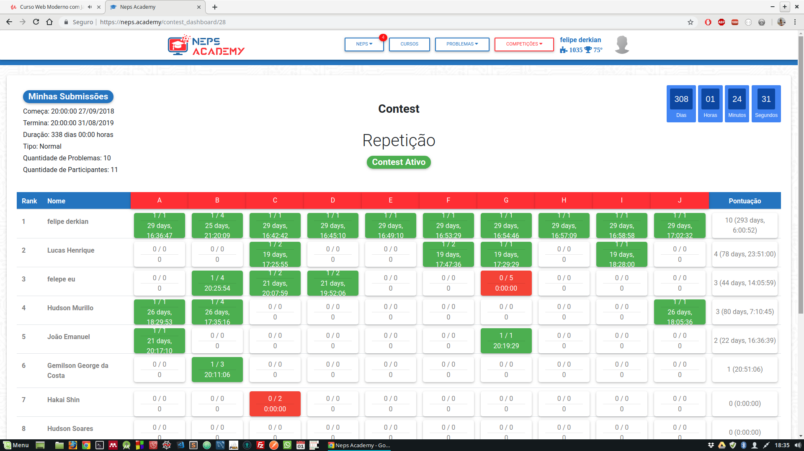
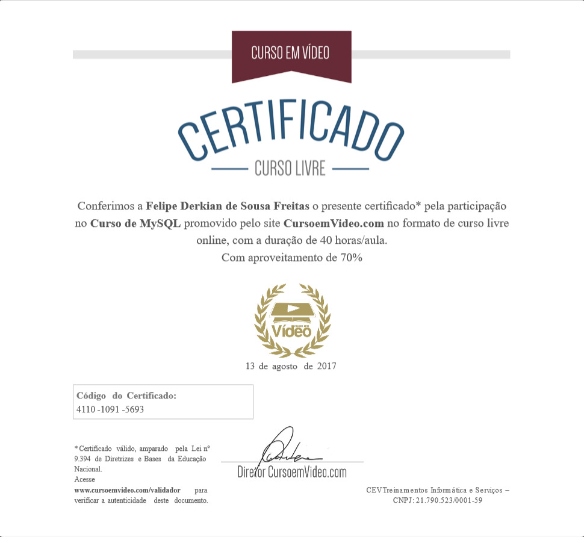
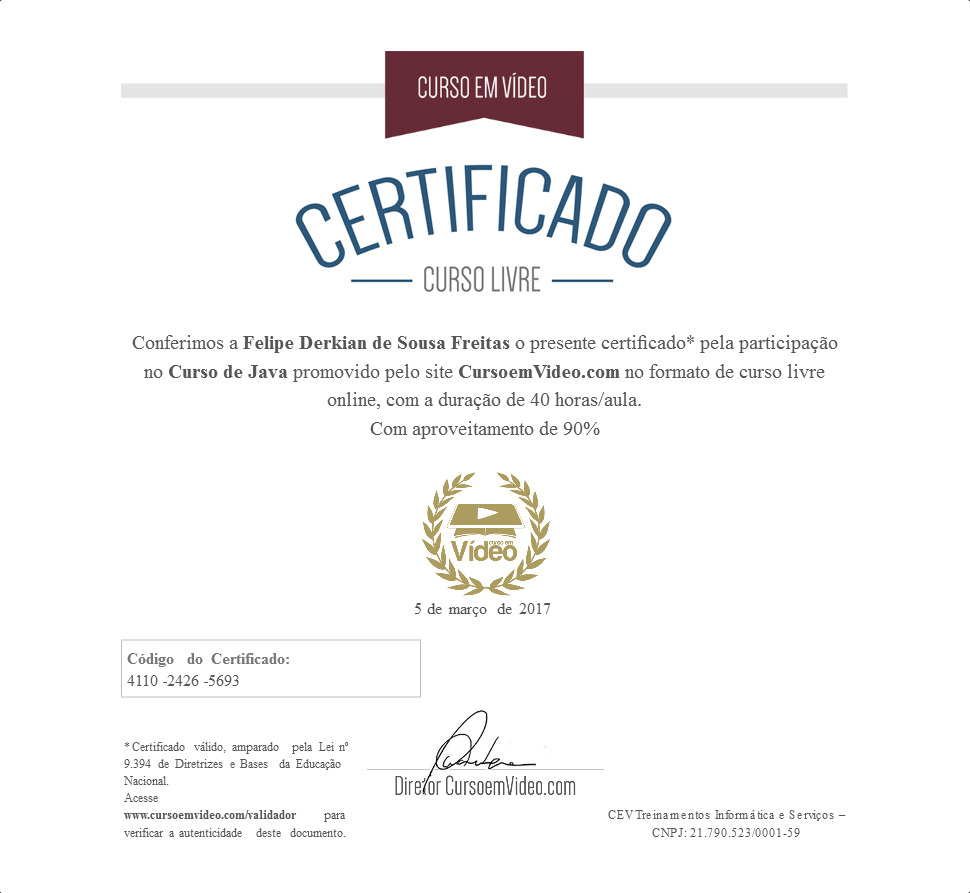
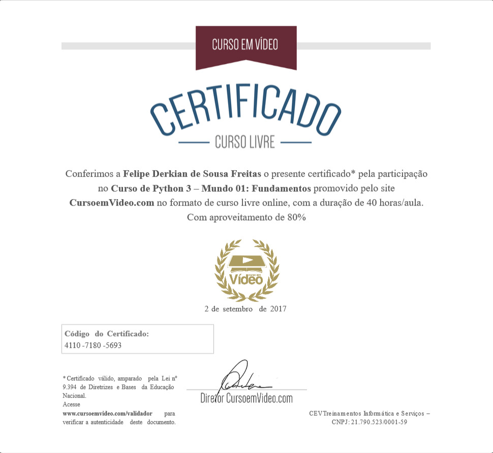

# Certificados De Cursos e Eventos

## Certificados Participações de Maratona de Programação SBC

### Contest Neps Academy

## Certificado de Linux LPIC-I - Udemy

## Certificado de Banco de Dados MySQL - Curso em Vídeo

## Certificado de Linguagem C - SOLID (EM INGLÊS)

## Certificado de Linguagem JAVA e JAVA POO - Curso em Vídeo
 

## Certificado de Linguagem PHP e PHP com MySQL - Curso em Vídeo e Udemy

## Certificado de Linguagem PHP com MySQL, JAVASCRIPT, JQuery, BOOTSTRAP - Udemy (Desenvolvimento WEB Completo)

## Certificado de Linguagem PYTHON 3 - Curso em Vídeo

## Certificado Python3 para Data Science e Machine Learning - Udemy

## Certificado de Unity Desenvolvimento De Jogos - Udemy

## Certificado Semana Da Computação

 

## Certificados V Jornada Científica da Computação - UFRR

## Certificados OUTROS CURSOS - UFRR

